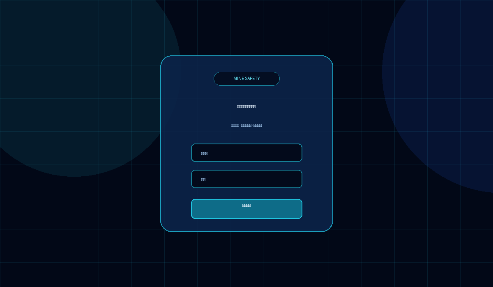
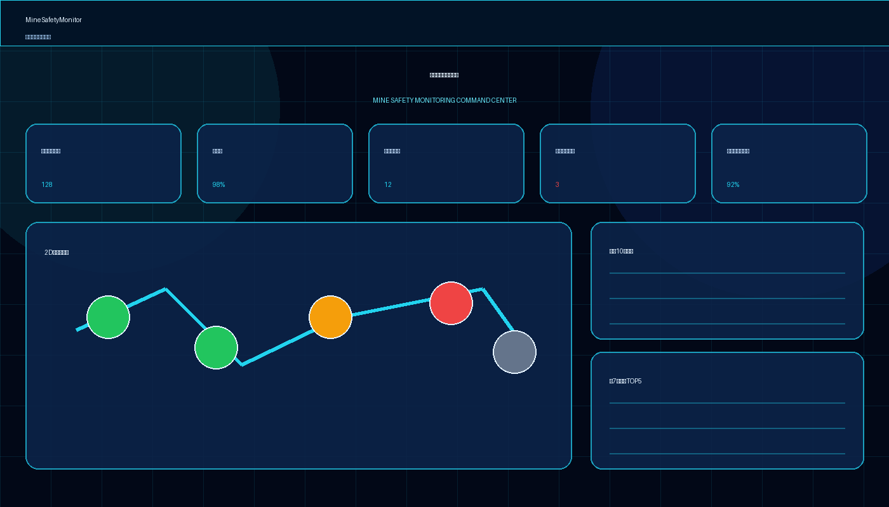
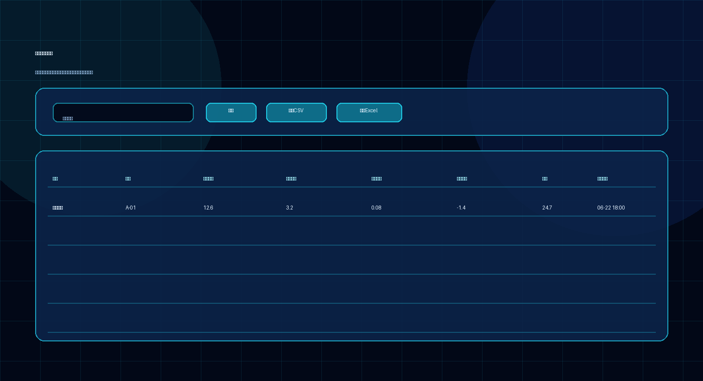
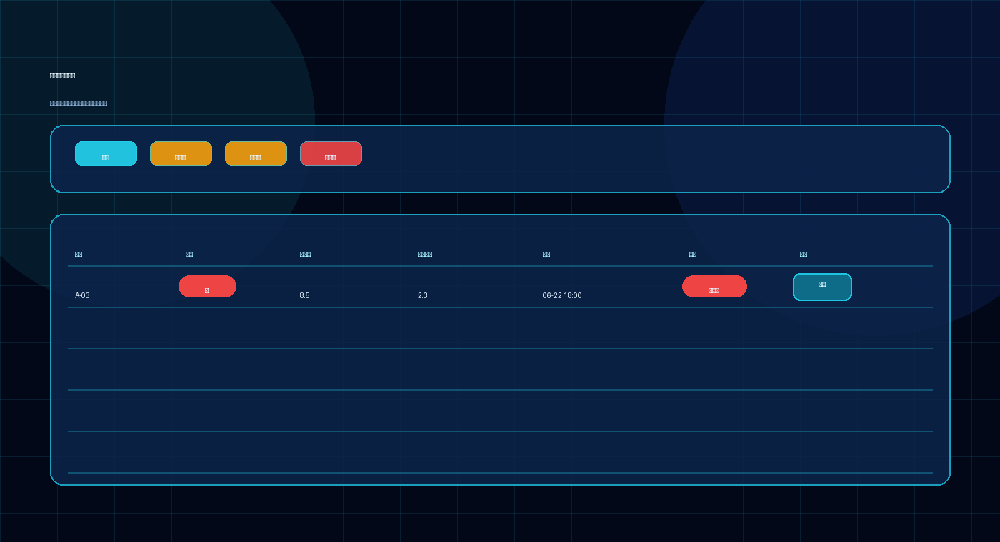
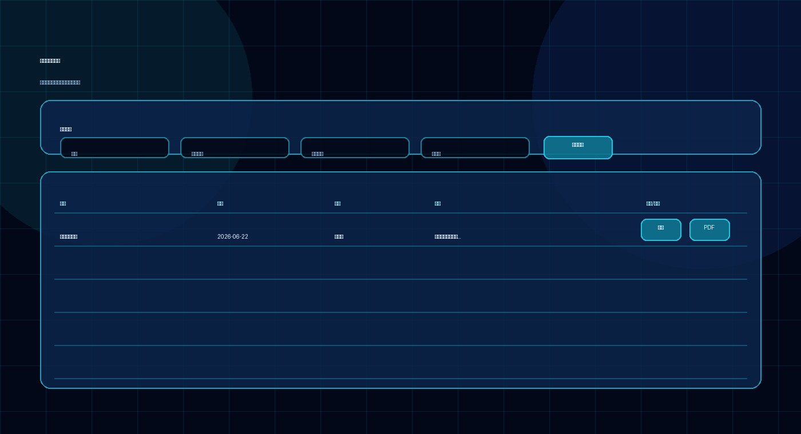

# MineSafetyMonitor

> james, whatever

**矿山安全监测与智能预警大屏系统**

MineSafetyMonitor 是一套面向矿山、巷道、隧道及地下工程场景的安全监测展示系统，围绕监测点位、变形数据、矿压数据、风险预警、智能报告和移动端查看等业务流程，提供一体化的安全监测驾驶舱和风险闭环管理能力。

本公开仓库仅用于项目展示与合作说明，**不包含项目源码**。

---

## 项目定位

MineSafetyMonitor 适用于需要对地下空间结构安全、巷道变形、矿压变化、测点状态和风险预警进行集中展示与管理的场景。

系统以“数据可视化 + 风险预警 + 报告归档 + 移动端查看”为核心，帮助管理人员、值班人员、测量人员和领导层快速掌握现场安全状态。

---

## 核心功能

### 1. 首页驾驶舱

- 监测点位总数统计
- 在线率展示
- 今日预警数量统计
- 未处置高风险统计
- 当月任务完成率展示
- 2D 巷道全景图
- 点位状态可视化
- 最新预警列表
- 近 7 天变形 TOP5

### 2. 监测数据管理

- 按监测点位查询数据
- 展示实时测距
- 展示累计收敛
- 展示变化速率
- 展示阈值差值
- 展示矿压数据
- 支持 CSV 导出
- 支持 Excel 导出

### 3. 风险预警管理

- 按预警等级筛选
- 展示预警点位、等级、变形值、超标倍数和时间
- 展示处置状态
- 支持预警处置填写
- 支持风险闭环管理

### 4. 智能报告生成

- 支持按周期生成报告
- 支持按巷道或全矿区生成报告
- 支持报告历史归档
- 支持审批批注
- 支持签字人记录
- 支持 PDF 导出

### 5. 系统配置

- 点位管理
- 巷道关联
- 点位状态管理
- 推送平台配置
- 推送对象配置
- 手持端同步配置
- 权限角色说明

### 6. 移动端适配

- 告警查看
- 报告浏览
- 测点数据查询
- 适配手持终端与移动浏览器

---

## 视觉与交互特点

- 深色科技风大屏界面
- 蓝色发光数据面板
- 指标卡片动态展示
- 巷道点位可视化
- 高风险状态突出显示
- 表格暗色主题优化
- 登录页沉浸式展示
- 响应式布局，兼容桌面端和移动端

---

## 适用场景

- 矿山安全监测平台
- 巷道变形监测系统
- 隧道安全监测系统
- 地下工程风险预警系统
- 企业安全生产驾驶舱
- 工程监测数据可视化平台
- 安全管理部门汇报展示大屏

---

## 目标用户

- 矿山企业
- 工程监测单位
- 安全生产管理部门
- 地下工程运维团队
- 项目管理方
- 第三方监测服务机构

---

## 页面效果预览

> 以下为截图预留位置，实际演示效果请联系作者获取。

### 登录页

### 首页驾驶舱

### 监测数据页

### 风险预警页

### 智能报告页

---

## 源码说明

本仓库为公开展示仓库，**不提供源码下载**。

如需了解以下内容，请联系作者：

- 项目演示
- 功能定制
- 私有化部署
- 二次开发合作
- 行业场景适配
- 商务合作

---

## 联系方式

联系方式暂未公开。

如需咨询，可通过本仓库 GitHub Issues 留言。

---

## 版权声明

本项目相关设计、文档、功能描述及演示内容归作者所有。

未经授权，不得复制、改编、转售或用于商业交付。

---

## Slogan

> james, whatever
